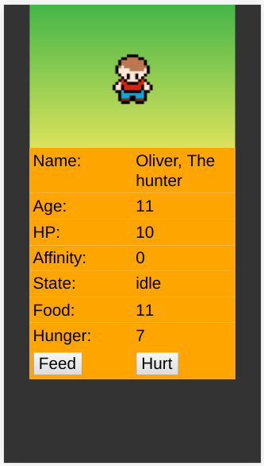

# GAIA

Generic Artificial Intelligence Agent.  
An AI concept that can help the game designer create procedural quests.

[Live version](https://victorribeiro.com/gaia).

## About

This project is a concept, it aims to design a generic Agent that can be interacted with any time during the game. It uses finite state machines alongside attributes to give the Agent purpose. The player can alter this states with it's actions, turning the Agent into a enemy or a friend.

## Concepts

In order to be interacted with, the agent must have some attributes to be interesting.

In this example, the Agent has a **name**, a **title**, **age**, **affinity** with the player, **hit points** (HP), **hunger**, **food** and some **states**.

This attributes can be used to design quests, if the player choose to interact with the Agent, or just a ordinary dialogs.

The Agent could answer it's name, it's age, how hungry it is, how much food it have, how close it is to dying and what it's doing. 

This information be used to create a quest. For example, lets suppose that the NPC is a shop owner that has a item that the player needs. 
If the NPC is busy hunting (or cutting wood, or fishing, or anything else other the selling) it won't be able to sell the item to the player. So the player could either kill the NPC and still the item, or help the NPC, giving him what it need or completing the action that restores them to they selling state (back to the store, for instance).

This way, any NPC that the player encounters during the game could offer a somewhat interesting interaction. 

## Examples

The player needs to cross a river and asks for a NPC on a boat to take them. The NPC could be busy fishing, so the player could fish for the NPC or just give it some fish, restoring it to a state where it can cross the player to the other side.

The player encounters a NPC that is very hungry and decide to feed it. This NPC then become friends with the player and could  retribute the favor later on the game.

## Interaction

In this example the Agent has 3 states: idle, hunting and dead. If the Agent is hunting, it roams the map looking for food.

You can help the Agent feeding it, increasing it's affinity towards you, by clicking **feed**.

You can also hurt the Agent, decreasing it's affinity towards you eventually killing it, by clicking **hurt**.
